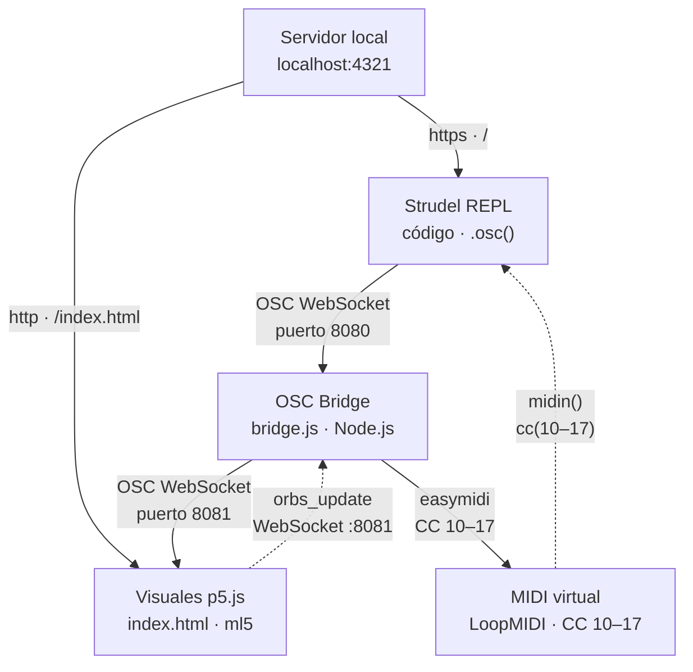

# Final SFI2 y VA

Un instrumento audiovisual en tiempo real controlado por gestos de mano. Cuatro orbes representan las capas de la composición (kick/snare, hats, bajo, arpegio) y responden al audio y a la posición de la mano en el espacio. Mover los orbes modifica parámetros de la música en vivo; la música modifica las visuales en tiempo real.

---

## Sección 1 — Diagrama del sistema



### Componentes

| Componente | Rol | Tecnología |
|---|---|---|
| Servidor local | Sirve Strudel y las visuales | Node.js (incluido en Strudel) |
| Strudel REPL | Motor de síntesis y secuenciación | Strudel (descarga local) |
| Visuales p5.js | Canvas interactivo con detección de gestos | p5.js + ml5.js (HandPose) |
| OSC Bridge | Retransmite mensajes OSC y convierte a MIDI | Node.js + `ws` + `easymidi` |
| MIDI virtual | Bus de comunicación para parámetros de los orbes | LoopMIDI (Windows) |
| Cámara web | Captura los gestos de mano | Hardware |

### Flujo de datos

**Audio → Visuales**
Strudel envía un mensaje OSC por WebSocket al puerto `8080` en cada evento de audio. El bridge lo retransmite al puerto `8081`. El p5 lo recibe, identifica el sample (`bd`, `sd`, `hh`, `piano`, `square`) y dispara `pulse` y `expand` en el orbe correspondiente.

**Visuales → Audio**
El p5 envía la posición normalizada (0–1) de cada orbe como `orbs_update` cada 3 frames. El bridge convierte `x` e `y` de cada orbe a mensajes CC MIDI (canales 10–17) y los envía al puerto LoopMIDI. Strudel los lee con `midin()` y los usa para modular volumen, velocidad, octava y delay.

---

## Sección 2 — Paso a paso para reproducir

### Requisitos previos

**Software (instalar en este orden)**

1. [Node.js](https://nodejs.org/) — versión LTS
2. [LoopMIDI](https://www.tobias-erichsen.de/software/loopmidi.html) — crea el bus MIDI virtual (solo Windows)
3. [Strudel](https://github.com/tidalcycles/strudel) — entorno de livecoding (descarga local, ver paso 2)
4. Chrome — navegador recomendado para WebGL y acceso a cámara

**Hardware**
- Cámara web (integrada o externa)
- Parlantes o auriculares

### Archivos de este repositorio

| Archivo | Descripción | Dónde va |
|---|---|---|
| `index.html` | Visuales p5.js | `strudel/packages/website/public/` |
| `bridge.js` | OSC Bridge | Cualquier carpeta, se ejecuta con Node |
| `strudel.js` | Código de composición | Solo se pega en el REPL, no se copia |
| `package.json` | Dependencias del bridge | Misma carpeta que `bridge.js` |

---

### Paso 1 — Instalar Node.js

Descarga e instala Node.js desde [nodejs.org](https://nodejs.org/). Elige la versión **LTS**.

Verifica que quedó instalado correctamente:
```bash
node --version
npm --version
```
Ambos deben devolver un número de versión (ej. `v20.11.0` y `10.2.4`).

### Paso 2 — Instalar y configurar Strudel

Clona el repositorio de Strudel y sigue sus instrucciones de instalación:
```bash
git clone https://github.com/tidalcycles/strudel.git
cd strudel
npm install
pnpm dev
```

Strudel quedará disponible en `http://localhost:4321`.

### Paso 3 — Copiar las visuales a Strudel

Copia el archivo `visualesFinal.html` de este repositorio a la carpeta pública de Strudel:

```
strudel/website/public/index.html
```

Las visuales estarán disponibles en: `http://localhost:4321/index.html`

### Paso 4 — Configurar LoopMIDI

1. Descarga e instala [LoopMIDI](https://www.tobias-erichsen.de/software/loopmidi.html)
2. Abre LoopMIDI
3. En el campo de nombre escribe exactamente `StrudelMIDI`
4. Haz clic en **+** para crear el puerto
5. Deja LoopMIDI abierto en segundo plano durante toda la sesión


### Paso 5 — Instalar dependencias del bridge

Coloca `bridge.js` y `package.json` en la misma carpeta (puede ser cualquier carpeta, no tiene que estar dentro de Strudel). Desde esa carpeta ejecuta:

```bash
npm install
```

Esto instala dependencias.

### Paso 6 — Iniciar el bridge

```bash
node bridge.js
```

Deberías ver en consola:
```
🚀 Bridge activo — p5:8081 | Strudel OSC:8080 | MIDI:StrudelMIDI
```

> Si aparece un error de MIDI, verifica que LoopMIDI esté corriendo y que el puerto se llame exactamente `StrudelMIDI`.

### Paso 7 — Abrir las visuales

En Chrome, abre: `http://localhost:4321/visualesFinal.html`

Acepta los permisos de cámara cuando el navegador los solicite.

### Paso 8 — Cargar la composición en Strudel

1. En otra pestaña del navegador, abre: `http://localhost:4321`
2. Abre el archivo `strudel.js` de este repositorio con cualquier editor de texto
3. Copia todo su contenido
4. Pégalo en el editor del REPL de Strudel
5. Acepta los permisos de MIDI cuando el navegador los solicite
6. Presiona **Ctrl+Enter** o botón play para iniciar la música

> `strudel.js` contiene código para el REPL de Strudel, no es un script de Node.js. No ejecutar con `node strudel.js`.

### Paso 9 — Usar el instrumento

Con todo corriendo, coloca la mano frente a la cámara en la ventana de visuales:

- **Puño cerrado** → todos los orbes se atraen hacia la posición de la mano
- **Pellizco (pulgar + índice)** → mueve el orbe más cercano individualmente
- **Mano abierta** → modo escucha, sin interacción

Cada orbe controla dos parámetros de su instrumento según su posición en el canvas:

| Orbe | Eje X | Eje Y |
|---|---|---|
| Kick · SD | Volumen drums | Velocidad del beat |
| Hats | Volumen hats | Velocidad de hats |
| Bass | Volumen bajo | Octava (salta entre octavas) |
| Arp | Atmósfera / delay | Velocidad del arpegio |

### Verificación

En las visuales deberías ver:
- `● en vivo` en la esquina inferior izquierda — bridge conectado
- Los orbes pulsando al ritmo de kick, hats, bajo y arpegio
- El fondo cambiando de color al mover el orbe del bajo
- El esqueleto de la mano con color según el gesto (morado = puño, amarillo = pellizco, verde = abierta)

### Solución de problemas

| Problema | Causa probable | Solución |
|---|---|---|
| `○ desconectado` en pantalla | Bridge no está corriendo | Ejecutar `node bridge.js` |
| Orbes no reaccionan al audio | Strudel no envía OSC | Verificar que el código tenga `.osc()` en cada patrón |
| Error de MIDI al iniciar bridge | LoopMIDI no está activo o el puerto tiene otro nombre | Abrir LoopMIDI y verificar nombre `StrudelMIDI` |
| Cámara no detectada | Permisos del navegador | Recargar la página y aceptar permisos de cámara |
| Audio no suena | Strudel no inicializado | Verificar que `await initAudio()` esté al inicio del código |
| `Cannot find module 'ws'` | Dependencias no instaladas | Ejecutar `npm install` en la carpeta del bridge |

---

## Sección 3 — Explicación y justificación

### Cómo funciona cada componente

**Strudel REPL** es el motor de secuenciación. Genera patrones de audio usando mini-notation (un lenguaje de patrones cíclicos) y los sintetiza en el navegador usando Web Audio API. La función `.osc()` duplica cada patrón y lo envía como mensaje OSC por WebSocket, lo que permite que el sistema de visuales sepa exactamente cuándo ocurre cada evento de audio.

**El bridge (bridge.js)** Opera en dos direcciones simultáneas: recibe los eventos OSC de Strudel (qué sample suena y cuándo) y los retransmite a las visuales; y recibe las posiciones de los orbes desde las visuales y las convierte a mensajes CC MIDI que Strudel puede leer como parámetros de control.

**Las visuales (p5.js + ml5)** son el instrumento físico. El canvas muestra cuatro orbes que representan las capas de la composición. ml5 HandPose ejecuta un modelo de detección de manos en tiempo real usando la cámara, identificando puntos de articulación. Los gestos se determinan calculando la distancia promedio de los dedos a la muñeca (puño) y la distancia entre pulgar e índice (pellizco).

**LoopMIDI** crea un bus MIDI virtual en el sistema operativo que permite que el bridge (Node.js) y Strudel (navegador) se comuniquen por MIDI sin hardware físico. Sin él, no hay forma de que un proceso de Node.js envíe mensajes MIDI que el navegador pueda recibir.

---

### Justificaciones técnicas

**¿Por qué Strudel y no Ableton, Max/MSP u otro entorno?**
Strudel corre completamente en el navegador. Esto elimina la instalación de software de audio pesado y hace el sistema más portable. Además, su sistema de patrones cíclicos es ideal para música repetitiva con variaciones graduales, exactamente lo que requiere una performance donde los parámetros cambian continuamente en tiempo real.

**¿Por qué WebSocket y OSC, y no MIDI directo entre Strudel y el canvas?**
Strudel tiene soporte nativo para emitir mensajes OSC por WebSocket (`.osc()`). El bridge en Node.js intercepta esos mensajes, los retransmite al p5 y simultáneamente convierte datos en la dirección inversa a MIDI. Una conexión directa entre dos contextos de navegador no es posible sin un intermediario del sistema operativo y el bridge resuelve eso con un solo proceso.

**¿Por qué CCs MIDI (10–17) y no otra forma de enviar parámetros?**
Strudel tiene soporte nativo para leer CCs MIDI con `midin()` y `cc()`. Los CCs transmiten valores continuos de 0 a 127 que se mapean fácilmente a rangos de parámetros musicales (volumen, velocidad, octava, delay). Ocho CCs permiten controlar simultáneamente cuatro capas de la composición con precisión suficiente para un performance en vivo.

**¿Por qué p5.js y no Three.js, Unity o Processing?**
p5.js tiene una curva de aprendizaje baja y un sistema de coordenadas intuitivo para trabajo en canvas 2D. El proyecto requiere formas orgánicas con ruido de Perlin, interpolaciones suaves y control preciso de alpha por capas, lo cual es nativo en p5. Además, ml5 se integra directamente con p5 fácilmente.

**¿Por qué ml5 HandPose y no MediaPipe u otra solución?**
ml5 HandPose es la opción con menor fricción para integrar detección de manos en un proyecto p5.js. Corre en el navegador, no requiere servidor externo, y devuelve 21 puntos con coordenadas normalizadas que se mapean directamente al canvas. Para el nivel de precisión que requieren los dos gestos del sistema (puño y pellizco), es suficiente.

**¿Por qué el index.html vive dentro de Strudel y no en un servidor propio?**
Strudel ya levanta un servidor local cuando se instala. Colocar el `visualesFinal.html` en su carpeta pública (`packages/website/public/`) permite servirlo desde el mismo origen sin configurar un segundo servidor.

---

### Justificaciones estéticas

**¿Por qué orbes y no botones, sliders u otras metáforas de interfaz?**
Los orbes son entidades vivas, no controles. Tienen un tamaño que responde a la frecuencia de su instrumento, un color que codifica su función, y una posición en el espacio bidimensional que mapea simultáneamente a dos parámetros musicales. Moverlos no se siente como ajustar un slider — se siente como reorganizar elementos de una composición en el espacio.

**¿Por qué gestos de mano y no un controlador MIDI físico?**
Un controlador MIDI fija los parámetros a botones y sliders con valores predefinidos. Los gestos en el espacio son continuos. El cuerpo del performer o usuario se vuelve visible y funcional en la performance, lo que lo transforma al en parte de la imagen proyectada.


**¿Por qué ese fondo — oscuro, con manchas de color que cambian con el movimiento?**
El fondo no es decoración, es el estado del sistema. El matiz del fondo cambia con la posición del orbe del bajo (que controla la octava), haciendo visible un parámetro. Las manchas de color se mueven a una velocidad determinada por la posición vertical promedio de todos los orbes, conectando el movimiento del performer con el movimiento del fondo. El resultado es un escenario que responde al performer sin imitar el ritmo, respira a una escala de tiempo más lenta.

**¿Por qué esa composición musical — G menor, tranquila, con espacio?**
La composición está diseñada para dejar espacio para la performance. Un tempo moderado, líneas de bajo lentas y una melodía con silencios intencionados crean un ambiente donde los cambios gestuales del performer son audibles. Una composición densa o rápida haría invisibles las modificaciones de parámetros — el oyente no podría distinguir si algo cambió. La música es el fondo sobre el que el performer pinta.

**¿Por qué participación gestual y no otro tipo de interacción?**
El gesto de la mano en el espacio tiene una cualidad que hace la interacción fácil para un público. A diferencia de un laptop donde la acción es invisible, mover un orbe con un gesto visible crea una relación causal perceptible entre el cuerpo del performer y el sonido. La performance se vuelve teatral sin perder su naturaleza técnica.
